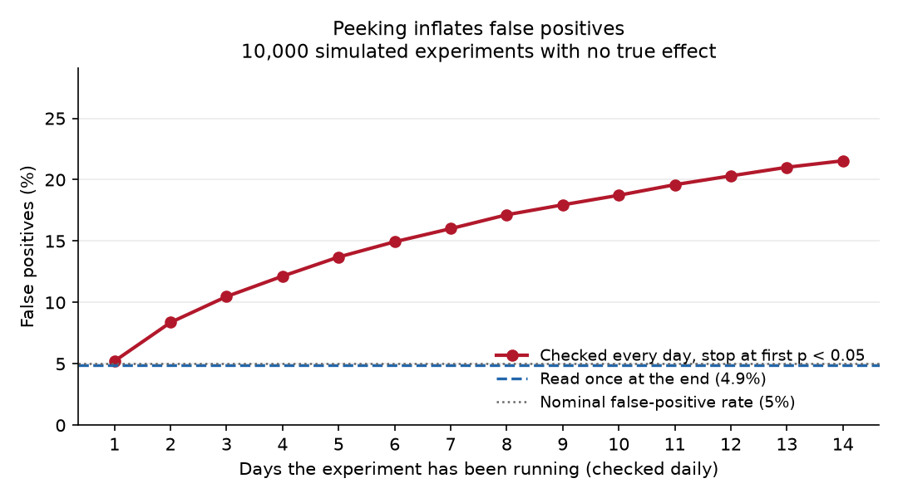

# Do not ship: keep the Cookie Cats gate at level 30

*An A/B test readout system that runs validity checks before it will show you a result — demonstrated here on a real public experiment. [How it works](#how-this-was-built) · [Design spec](SPEC.md) · [Every decision, with reasons](docs/decisions.md)*

---

**The experiment:** Moving the first progression gate from level 30 (gate_30) to level 40 (gate_40) in the mobile game Cookie Cats. Randomised at install; 90,189 players.

**The finding.** At day-7 retention, the change made things worse by 4.3% — a difference too large and too consistent to be chance (p = 0.0016).

Every horizon points the same way, but only Day-7 retention is distinguishable from noise; Day-1 retention is not. The point estimates agree — what changes with the horizon is whether the effect is detectable at all, and therefore what a team reading that horizon would decide.

> **⚠ Caveat that applies to every number below — sample ratio mismatch.**
>
> p = 0.0086 sits between the warn (0.05) and block (0.001) thresholds. The imbalance is unlikely to be chance and is reported next to every estimate, but it is small in magnitude and applies equally to every metric and horizon, so it cannot by itself reverse the sign of an effect.

## What it costs to be wrong

**If this recommendation is wrong and the change was actually fine:** the cost is the engineering time already spent, plus whatever upside the change would have delivered. The measured effect on day-7 retention was -4.31%, so the forgone upside is bounded by roughly that much in the opposite direction — small.

**If the change ships and this recommendation was right:** every new user is affected, permanently, and the damage compounds silently. The harm does not show up in the metric most teams watch — at the shortest horizon it is invisible. A drop of 0.82 percentage points across a cohort the size of this experiment (90,189 players) is about 740 players who would have come back and now do not — every cohort, indefinitely, until someone thinks to re-measure at a longer horizon.

The asymmetry is the argument: one mistake costs a sprint, the other costs users continuously and quietly.

## How this experiment was read

**Once, at the final horizon.** That was decided before looking at the result, and it matters more than it sounds.

Checking an experiment daily and stopping the moment it looks significant does not give you an answer sooner — it gives you a wrong answer more often. Simulating 10,000 copies of this experiment with **no real effect at all**, sized exactly like this one:

| Reading protocol | Times it declared a winner that does not exist |
|---|---|
| Read once at the end | 4.9% |
| Checked daily for 14 days, stop at first p < 0.05 | **21.5%** (4.4x) |



This is an organisational failure before it is a statistical one. Nobody sets out to do it; someone asks how the test is looking on day 2, and "we don't know yet, and looking now makes the final answer worse" is an expensive sentence to say. Writing the protocol down in advance is what makes it cheap.

## Was the experiment itself sound?

These checks run before any result is calculated. If one of them fails hard, this document does not show a result at all.

| Check | Status | Finding |
|---|---|---|
| Sample ratio mismatch | WARN | observed gate_30 49.56%, gate_40 50.44% vs intended gate_30 50%, gate_40 50%, chi2=6.9024, p=0.008608 |
| Duplicate assignments | PASS | every unit_id appears exactly once |
| Cross-contamination | PASS | every unit belongs to exactly one variant |
| Orphan events | PASS | every event belongs to an assigned unit |
| Zero-activity units | n/a | every event type in this dataset is an outcome being measured |
| Pre-period balance | n/a | no pre-treatment covariates exist in this dataset |

- **Sample ratio mismatch — WARN.** p = 0.0086 sits between the warn (0.05) and block (0.001) thresholds. The imbalance is unlikely to be chance and is reported next to every estimate, but it is small in magnitude and applies equally to every metric and horizon, so it cannot by itself reverse the sign of an effect.
- **Zero-activity units — n/a.** This check looks for units that never showed up at all — a sign of differential logging, or of the treatment driving units away before they could act. It needs an activity signal that is not itself an outcome. Here the only event type(s) present (game_rounds, return_d1, return_d7) are the metrics under test, so a unit with no events is simply a unit that did not convert, and any genuine treatment effect would trip this check. Reported as non-diagnostic rather than run and reported as a pass or a warning.
- **Pre-period balance — n/a.** Nothing in this dataset was known before randomisation, so there is nothing to check balance on. This is a property of the data, not an analysis that was skipped — see SPEC.md §5.2.

## Could this experiment have answered its own question?

With 44,700 and 45,489 users per arm, here is the smallest effect this experiment could reliably detect at each horizon — at the conventional 5% significance and 80% power:

| Horizon | Baseline | Smallest detectable effect | Worth acting on | Could it have seen that? |
|---|---|---|---|---|
| Day-1 retention | 44.82% | 2.07% relative (+0.928% absolute) | 1.0% | **no** |
| Day-7 retention | 19.02% | 3.85% relative (+0.732% absolute) | 1.0% | **no** |

- **Day-1 retention:** the observed 1.32% effect is *smaller* than the 2.07% this horizon could detect. Finding nothing here was close to guaranteed regardless of whether anything was happening — so "no significant difference at day 1" is not evidence that the change was harmless.
- **Day-7 retention:** the observed 4.31% effect is larger than the 3.85% this horizon could detect, which is why it registers as a result.

That asymmetry is the whole story of this experiment. The short horizon was not capable of seeing an effect of the size that actually existed; the long horizon was, and only barely.

The MDE depends on the baseline rate, which is why it differs between horizons rather than being one number for the experiment. All of it is calculated from sample size and the control group alone — it never looks at the treatment result, which is why it appears before the numbers rather than after them.

## The numbers

### Retention (primary)

| Horizon | Control | Treatment | Difference | 95% CI (relative) | p | Readable? |
|---|---|---|---|---|---|---|
| Day-1 retention | 44.8188% | 44.2283% | -1.32% | -2.75% to +0.13% | 0.0744 | **no — inside noise** |
| Day-7 retention | 19.0201% | 18.2000% | -4.31% | -6.93% to -1.65% | 0.0016 | yes |

Intervals are bootstrap percentile intervals from 10,000 resamples (exact binomial bootstrap) — the experiment re-run ten thousand times using only the users actually observed.

### Guardrails

Reported whether or not they are convenient — a change that improves the primary metric while damaging something else has not succeeded.

**Game rounds played (14d)**

| Horizon | Control | Treatment | Difference | 95% CI (relative) | p | Readable? |
|---|---|---|---|---|---|---|
| Mean rounds per player (14d) | 52.46 | 51.30 | -2.21% | -7.38% to +1.91% | 0.3759 | **no — inside noise** |

> Post-treatment, so it is used ONLY as an outcome — never for segmentation and never as a CUPED covariate (SPEC.md §5.2). See the adapter docstring for why the same column is legitimate on one side of the analysis and disqualifying on the other.


## What this data cannot tell us

**Which users this affected — declined, not missing.** The obvious follow-up is "did this hurt everyone, or only some players?" That question cannot be answered honestly with this data, and the analysis was deliberately not run.

The only column that looks like it would work is the number of game rounds each player played. It cannot be used. Players were randomised when they installed, and rounds played is measured over the 14 days *after* that — so the change being tested could itself have altered it. Splitting the results by engagement level would mean comparing groups that the treatment helped define, and any difference found would be partly an artefact of the split rather than a real effect. This is collider bias, and it is the single most common way a segmentation analysis produces a confident wrong answer.

The same column is used freely as a *guardrail outcome* above. That is not a contradiction: measuring whether the change moved engagement is fine, because nothing is being conditioned on. Splitting by it is not. Post-treatment variables are disqualified from one side of an analysis, not from both.

For the same reason, CUPED — the standard technique for making an experiment more sensitive using each user's prior behaviour — cannot be applied here. There is no pre-experiment behaviour in this dataset at all.

**Nothing about *when* the effect appeared.** The dataset has no timestamps, only two precomputed flags. So the reading-protocol section above is a simulation sized to this experiment, not a replay of it, and no genuine day-by-day analysis is possible on this data.

**Sample ratio mismatch.** p = 0.0086 sits between the warn (0.05) and block (0.001) thresholds. The imbalance is unlikely to be chance and is reported next to every estimate, but it is small in magnitude and applies equally to every metric and horizon, so it cannot by itself reverse the sign of an effect.

**Anything about why.** This is an experiment, not research. It establishes that moving the gate changed behaviour and by how much. It says nothing about the mechanism, and the obvious story — that a later gate means players hit the paywall after their interest has already peaked — is a hypothesis this data cannot test.

---

## How this was built

This is a reusable readout system, not a notebook for one dataset. Any experiment is mapped into **two tables** — `assignments` (one row per unit) and `events` (one row per unit-event) — and nothing downstream is allowed to know where the data came from. Adding an experiment means writing an adapter and a config, not editing the analysis.

```
adapters/   the ONLY code that knows a dataset's column names
sql/        all aggregation: diagnostics, metrics, segments (CTEs, window functions)
analysis/   bootstrap, power/MDE, peeking simulation
readout/    the contract, the gate, and the output surfaces
tests/      including the corrupted-input test the gate has to pass
docs/       the dataset selection log, and every decision with its reasoning
```

Three things it does that the notebook version of this analysis would not:

1. **It refuses to answer when it should not.** If a validity check fails hard, no effect estimate is computed at all — not computed and hidden, not computed with a warning attached. Numbers get pasted into decks and caveats do not travel with them. `tests/test_gate.py` corrupts the input deliberately and proves the block fires.
2. **Diagnostics and power run before any result exists.** Enforced by construction in `readout/run.py` rather than by remembering to do things in the right order.
3. **It states what it cannot support.** The segmentation analysis was declined on methodological grounds and the reasoning is written down, rather than the analysis being quietly omitted.

**Status.** Phases 0–4 are complete: the system runs end to end on Cookie Cats and everything above is generated from it. A second case study — the 13.9M-row Criteo uplift experiment, which is the one with genuine pre-treatment covariates and therefore the one that can carry segmentation and CUPED — is selected and specified but **not yet run**. The claim that the contract generalises unchanged is not proven until it does, and this README will not make it before then. [`docs/dataset_selection.md`](docs/dataset_selection.md) records how that dataset was chosen and why three others were rejected on methodological grounds.

## Reproducing this

```bash
pip install -r requirements.txt
bash data/download.sh
python -m readout.cli memo --config config/cookie_cats.yaml --out README.md
```

_Generated from 90,189 source rows (90,189 assignments, 147,123 events, 0 rejected). Every number above is computed by the pipeline. Nothing in this file is typed by hand, so the memo cannot drift away from what the code actually found._